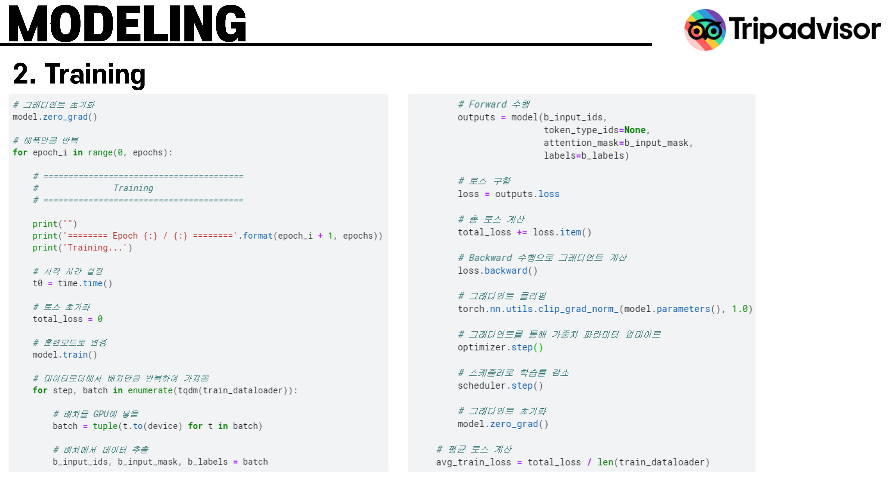
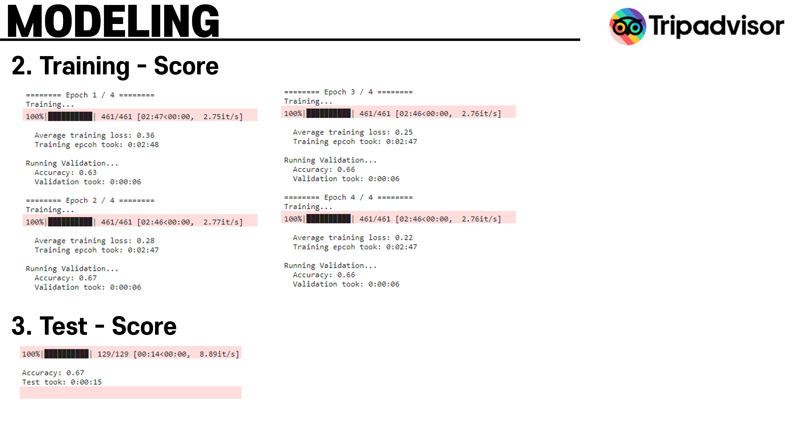

# 2023-1 Text Mining
2023년 1학기 텍스트 마이닝 과제로 사용된 코드입니다.

## 과제 1. 텍스트 데이터를 이용한 텍스트 데이터 로드 및 전처리
* Tokenization
* stopword
* stemming
* encoding - onehot, BOW

## 과제 2. 텍스트 데이터를 이용한 임베딩
* TF-IDF
* Word2vec, Glove
* FastText

## Term Project. Trip advisor hotel review analysis using BERT
### Problem Description
 
 
 
### Preprocessing
 
 
 
 
 
### Method
 
 
 
 
### Result
